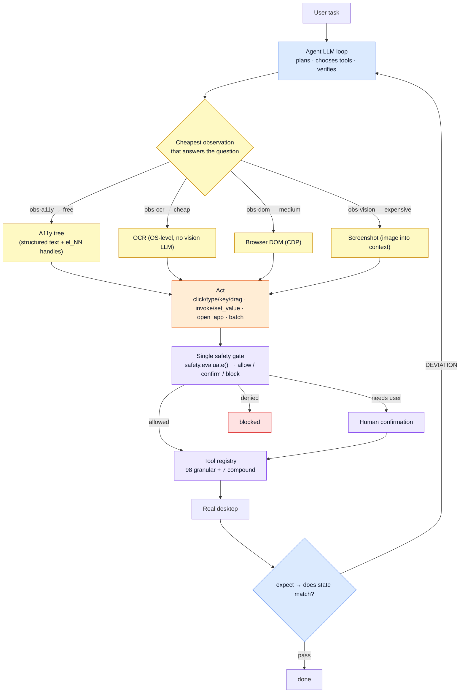

<h1 align="center">Clawd Cursor</h1>

<p align="center">
  <strong>Safe desktop control for any AI agent.</strong> Compiles the screen into a UI map and acts on elements by stable id (screenshot/vision only as a last resort),<br>
  <strong>verifies its own actions</strong>, and gates everything through one safety checkpoint. Local &middot; cross-OS &middot; any model.
</p>

<p align="center">
  <a href="LICENSE"></a>
  <a href="https://github.com/AmrDab/clawdcursor/releases/latest"></a>
  <a href="https://www.npmjs.com/package/clawdcursor"></a>
  
  
  <a href="https://github.com/AmrDab/clawdcursor/actions/workflows/cross-platform.yml"></a>
  <a href="https://discord.gg/hW29nrEZ8G"></a>
</p>

<p align="center">
  <a href="#60-second-quickstart">Quickstart</a> &middot;
  <a href="#why-its-different">Why it's different</a> &middot;
  <a href="#the-engine">The engine</a> &middot;
  <a href="#how-it-works">How it works</a> &middot;
  <a href="#the-toolbox">Tools</a> &middot;
  <a href="#platform-support">Platforms</a> &middot;
  <a href="CHANGELOG.md">Changelog</a>
</p>

<!-- ───────────────────────────────────────────────────────────────────────────
  DEMO: the single highest-leverage thing on this page for a *visual* tool.
  Record a 15–25s screen capture of clawdcursor driving a real app end-to-end
  (open app → find a field by name → type → verify), export to docs/demo.gif,
  and uncomment the block below (it will sit right under the hero).

  <p align="center">
    
    <br><em>Opening an app, finding a field by name, typing, and verifying the result — accessibility-first, locally.</em>
  </p>
─────────────────────────────────────────────────────────────────────────── -->

---

## What it is

Clawd Cursor is a **local MCP server** that gives any tool-calling agent &mdash; Claude Code, Cursor, Windsurf, OpenClaw, the Claude Agent SDK, or your own loop &mdash; safe control of the **real desktop**. It clicks, types, reads the screen, opens apps, and drives any GUI the way a human would: native apps, the browser, even a canvas.

Most "let an agent use the computer" tools take a screenshot and feed it to a vision model &mdash; slow, expensive, and brittle. Clawd Cursor **compiles the screen into one UI map**: it fuses the accessibility tree and OCR into a confidence-scored set of elements, each tagged with a stable `el_NN` id, and acts on elements by id &mdash; not pixel coordinates. Coordinates appear only in the last-resort screenshot/vision tier (live pixels off the current frame), for canvas-only apps or tasks that genuinely need spatial reasoning. The result is cheaper, faster, private, and &mdash; uniquely &mdash; it **checks that each action actually did what it claimed**.

> **If a human can do it on a screen, your agent can too.** No API, no integration, no problem &mdash; only the right sequence of reads, clicks, keys, and waits. Use it as the **last-mile fallback**: native API exists? Use it. CLI? Use it. Clawd Cursor is for the click, the legacy app, the GUI with no public surface.

---

## Why it's different

The desktop-agent space is crowded. The closest **install-and-go** peers are [Windows-MCP](https://github.com/CursorTouch/Windows-MCP) and [Terminator](https://t8r.tech/) (desktop MCP servers); browser-only tools (browser-use, Playwright MCP) are adjacent; and [OmniParser](https://github.com/microsoft/OmniParser) / [UI-TARS](https://github.com/bytedance/UI-TARS-desktop) are vision-centric *parsing approaches* you'd build an agent around, not products you install. Here's the honest comparison across those approaches &mdash; what Clawd Cursor does that the popular options don't:

|                                          | **Clawd Cursor**        | browser-use | Playwright MCP | OmniParser / UI-TARS | computer-use |
|------------------------------------------|:-----------------------:|:-----------:|:--------------:|:--------------------:|:------------:|
| Any desktop app, not just the web        | ✅                      | web only    | web only       | ✅                    | ✅           |
| Cross-OS (Windows + macOS + Linux)       | ✅                      | &mdash;     | &mdash;        | varies               | sandbox      |
| Perception **without a vision model**    | ✅ compiled a11y + OCR map | DOM      | a11y tree      | ❌ vision-centric     | ❌ vision    |
| **Verifies its own actions** (deviation) | ✅                      | &mdash;     | &mdash;        | &mdash;              | &mdash;      |
| Single safety chokepoint (allow/confirm/block) | ✅                | &mdash;     | &mdash;        | &mdash;              | &mdash;      |
| Any model / vendor                       | ✅                      | ✅          | not an agent   | model-specific       | Claude only  |
| MCP-native (one config, any host)        | ✅                      | library     | test framework | &mdash;              | tool-use API |
| Local-only, no cloud required            | ✅                      | ✅          | ✅             | needs a model        | screens → cloud |

Three things here are genuinely rare:

1. **Cheapest-tier-first perception, fully local.** Accessibility tree (free) → OCR (cheap) → screenshot (expensive — the *only* tier that puts pixels in the model's context; "screenshot" and "vision" are the same step). The agent climbs only when it must, so token cost tracks task difficulty &mdash; and with a local model, nothing leaves the machine. Vision-centric agents (OmniParser, UI-TARS) need a screenshot in the model for *every* observation.
2. **It verifies.** Pass `expect` on a consequential action and Clawd Cursor re-checks the live screen (with a short settle window for async UIs) and reports a **DEVIATION** instead of a hollow "success." A completed task can't be marked done on evidence that was already true before it acted.
3. **One safety gate.** Every call &mdash; from an editor over stdio, an external agent over HTTP, or the built-in loop &mdash; routes through a single `safety.evaluate()` chokepoint (allow / confirm / block) before it touches the desktop. The agent cannot bypass it.

Plus: an on-screen **"desktop control in progress" banner** with a blinking red dot whenever an agent is driving &mdash; **double-click it to stop.** A human at the machine always knows, and always has a kill switch.

---

## Install

clawdcursor is an MCP server published to npm — install it into **any** MCP-capable
agent (Claude Code, Claude Desktop, Cursor, Windsurf, Zed, OpenAI Codex, or your own
loop) the same way you install any other MCP server.

### 1 — Install the engine + grant consent (once)

```bash
npm i -g clawdcursor
clawdcursor consent --accept    # one-time desktop-control consent (required)
clawdcursor grant               # macOS only — approve Accessibility + Screen Recording
```

> **Zero-install** also works — swap `clawdcursor` for `npx -y clawdcursor` in any
> snippet below and npx fetches it on demand. A **global install is recommended**
> anyway: it's pinnable and inspectable on disk (safer for a tool with full desktop
> control than auto-fetching `latest` every run), and it's the path on which the macOS
> native helper builds at install time. Requires **Node.js 20+**.

> **Per-OS prerequisites.** **Windows** installs clean — `sharp` and `@nut-tree-fork/nut-js`
> ship prebuilt binaries, so no C++/Python build tools are needed. **macOS** needs Xcode
> Command Line Tools (`xcode-select --install`) for screenshots / vision; core
> accessibility-driven control still works without them. **Linux** needs a few system
> packages npm can't install: `tesseract-ocr` (OCR), `python3-gi` + `gir1.2-atspi-2.0`
> (accessibility tree), and — on Wayland — `ydotool` (synthetic input).

### 2 — Add it to your agent (pick your host)

**Claude Code**
```bash
claude mcp add clawdcursor -s user -- clawdcursor mcp --compact
```

**OpenAI Codex** — add to `~/.codex/config.toml`:
```toml
[mcp_servers.clawdcursor]
command = "clawdcursor"
args = ["mcp", "--compact"]
```

**Cursor / Windsurf / Zed / Claude Desktop** — add to the host's MCP config:
```json
{
  "mcpServers": {
    "clawdcursor": { "command": "clawdcursor", "args": ["mcp", "--compact"] }
  }
}
```

That's the whole setup. Ask your agent: *"open Outlook and reply to the latest email
from Sarah."*

### Or: one-command plugin (Claude Code)

Skip the manual config — this repo ships a plugin that registers the tools **and**
bundles the usage skill in one step. It resolves the package's `bin` (never a
hard-coded `dist/` path), so an upgrade can't break it:

```bash
claude plugin marketplace add AmrDab/clawdcursor
claude plugin install clawdcursor@clawdcursor
```

<details>
<summary>One-line installers (clone + build; handles the macOS native build)</summary>

```powershell
# Windows (PowerShell)
powershell -c "irm https://clawdcursor.com/install.ps1 | iex"
```
```bash
# macOS / Linux
curl -fsSL https://clawdcursor.com/install.sh | bash
```
</details>

> **Notes.** You never run `clawdcursor mcp` yourself — the host spawns it over stdio
> on demand. `clawdcursor doctor` is **not** part of MCP setup; it only configures the
> built-in LLM for the autonomous `agent` daemon. On macOS, **Accessibility is
> required** (primary control path); **Screen Recording is optional** (vision fallback
> only). For editor permission allowlists, use the server-level wildcard
> `mcp__clawdcursor` rather than per-tool entries — it survives tool renames.

---

## The engine

The perception + verification core (the **UI State Compiler**, since v1.5.0):

- **`compile_ui`** fuses the accessibility tree and OCR into one confidence-scored map of the screen, every element tagged with a stable `el_NN` id. Act on an element by `{element_id, snapshot_id}` instead of pixels &mdash; near-free in tokens, and it survives DPI, resize, and layout shifts. `find_button` / `find_field` locate a target by meaning and hand you the id.
- **Reactive verification.** `expect` on an action → Clawd Cursor confirms the outcome on the live screen and returns a **DEVIATION** when the UI didn't obey.
- **Cross-platform parity.** The compiler, secure-field redaction, and coordinate handling run on Windows, macOS, and Linux; the external-agent (MCP) surface resolves `el_NN` refs through the safety gate and discloses when it attached to your existing browser.

> Set-of-Mark-style element IDs and a11y/OCR fusion aren't new ideas on their own &mdash; what's rare is doing them **locally, a11y-first (no vision model required), with a built-in verification gate and one safety chokepoint**, across three operating systems, behind a single MCP config.

See the [changelog](CHANGELOG.md) for the full release history, or the [latest release](https://github.com/AmrDab/clawdcursor/releases/latest).

---

## How it works

**Where the brain lives** decides how you run it. Both modes can run side-by-side.

| Brain lives… | Mode | Command | What you call |
|---|---|---|---|
| In your editor (Claude Code, Cursor, Windsurf, Zed) | Direct tools | `clawdcursor mcp` | Each tool, via stdio MCP |
| In a headless agent with its own LLM (OpenClaw, Agent SDK, your loop) | Direct tools | `clawdcursor agent --no-llm` | Same, over HTTP MCP |
| Inside Clawd Cursor itself (scheduled / "submit and walk away") | Thin agent loop | `clawdcursor agent` + `doctor`-configured LLM | `task` / `submit_task` |
| External brain that delegates sub-tasks to the built-in loop | Direct + delegation | `clawdcursor agent` + your client | `task({instruction:…})` to hand off |

### The loop

Read the a11y tree (cheap) → act on named targets → verify from fresh observations → escalate perception only when needed (OCR → screenshot, the one tier that sends pixels to the model). Sparse a11y tree? `system.detect_webview` switches Electron/WebView2 apps to `browser.*` over CDP. Canvas-only (Paint, Figma, games)? Screenshot + coordinate click.



**`batch` for deterministic stretches.** When the next N steps are known, collapse them into one call &mdash; each step still routes through the safety gate; on any guard miss or error the batch halts with a per-step trace.

**Task delegation.** With an LLM configured on the daemon, an external agent can hand off at any point: `task({"instruction":"…"})`. The built-in loop takes the wheel and reports back &mdash; offload grunt work to a cheaper model without burning your own context.

---

## The toolbox

Two catalogs ship side-by-side. The **toolbox** is 7 compound tools, each with an `action` enum covering ~10–20 verbs (~1,500 tokens total &mdash; about 12× smaller than granular, the `computer_20250124` shape editor hosts already know). The **granular** surface is the 98 underlying primitives, one schema per verb (for runtimes that need top-level tools, or for debugging). Both run through the same `safety.evaluate()` chokepoint; the full catalog is always visible via MCP `tools/list`.

| Toolbox | Actions |
|---|---|
| `computer` | `screenshot`, `click`, `double_click`, `right_click`, `triple_click`, `hover`, `move`, `scroll`, `scroll_horizontal`, `drag`, `drag_path`, `type`, `key`, `wait` |
| `accessibility` | `read_tree`, `find`, `get_element`, `focused`, `invoke`, `focus`, `set_value`, `get_value`, `expand`, `collapse`, `toggle`, `select`, `state`, `list_children`, `wait_for`, `compile_ui`, `find_button`, `find_field`, `smart_click`, `smart_type`, `smart_read` |
| `window` | `list`, `active`, `focus`, `maximize`, `minimize`, `restore`, `close`, `resize`, `list_displays`, `screen_size`, `open_app`, `open_file`, `open_url`, `switch_tab`, `navigate` |
| `system` | `clipboard_read`, `clipboard_write`, `system_time`, `ocr`, `undo`, `shortcuts_list`, `shortcuts_run`, `delegate`, `detect_webview`, `relaunch_with_cdp`, `system_prompt`, `build_uri`, `open_uri`, `open_app`, `open_file`, `open_url`, `detect_app`, `app_guide`, `learn_app` |
| `browser` | `connect`, `page_context`, `read_text`, `click`, `type`, `select_option`, `evaluate`, `wait_for`, `list_tabs`, `switch_tab`, `scroll` |
| `task` | `run` (default; **bounded-sync** &mdash; waits up to `timeout`s, returns `{status:"running"}` + progress if longer, re-call to keep waiting), `status`, `abort`. Delegates to the built-in loop. Requires `clawdcursor agent` with an LLM. |
| `batch` | `{steps:[…]}` &mdash; collapse N calls into one round-trip; each step `{name, arguments, expect?}`, re-perceived and safety-gated, halts with a trace on any miss. |

```js
computer({ action: "key", combo: "mod+s" })          // Cmd+S / Ctrl+S, resolved per-OS
accessibility({ action: "invoke", name: "Send" })    // click by name, not pixels
window({ action: "open_app", name: "Outlook" })
task({ instruction: "open Notepad and type hello" }) // hand off to the thin loop
```

---

## Cheapest-tier-first perception

Every observation has a cost. Start at the cheapest rung that works; climb only when it fails. The live log (`CLAWD_LOG=pretty`, default on a TTY) shows the ladder in real time via per-call badges.

| Tier | Badge | Cost | Source | When |
|---|---|---|---|---|
| **T1** structured | `obs·a11y` | ~free | `accessibility.*`, `window.*`, `browser.read_text`, clipboard | Default. Text + bounds, no image, no vision LLM. |
| **T2** OCR | `obs·ocr` | cheap | `system.ocr`, `smart_read` / `smart_click` / `smart_type` | A11y tree empty/sparse. OS-level text out, no image bytes. |
| **T3** DOM | `obs·dom` | medium | `browser.read_text` / `page_context` (CDP) | WebView / Electron / Chrome content. |
| **T4** screenshot (vision) | `obs·vision` | expensive | `computer.screenshot` | The only tier that puts pixels in the model's context. Canvas-only apps or spatial reasoning. Last resort. |

Acting tools log `act`. Watching `obs·a11y → act → obs·a11y` on a normal turn &mdash; and the rare climb to `obs·vision` &mdash; is the whole efficiency model, visible.

---

## Transports

One protocol &mdash; **MCP** &mdash; two transports, same catalog and JSON-RPC envelope. Both stateless; no session handshake.

| Transport | When | Client config |
|---|---|---|
| **stdio MCP** | Editor hosts. Tools appear on demand &mdash; no daemon. | `{"command":"clawdcursor","args":["mcp","--compact"]}` |
| **HTTP MCP** | Headless agents, daemons, orchestration, Agent SDK. POST JSON-RPC to `http://127.0.0.1:3847/mcp`. | Run `clawdcursor agent`. Bearer token at `~/.clawdcursor/token`. |

```bash
# HTTP MCP — list tools
curl -s -X POST http://127.0.0.1:3847/mcp \
  -H "Authorization: Bearer $(cat ~/.clawdcursor/token)" \
  -H "Content-Type: application/json" \
  -d '{"jsonrpc":"2.0","id":1,"method":"tools/list"}'
```

---

## Platform support

Platform code lives behind a single `PlatformAdapter` interface (`src/platform/{windows,macos,linux}.ts` + `wayland-backend.ts`). Business logic never reads `process.platform`.

| Platform | UI Automation | OCR | Browser (CDP) | Input |
|---|---|---|---|---|
| **Windows** 10/11 (x64 / ARM64) | UIA via PowerShell bridge | `Windows.Media.Ocr` | Chrome / Edge | nut-js |
| **macOS** 12+ (Intel / Apple Silicon) | JXA + System Events (TCC-safe) | Apple Vision | Chrome / Edge | nut-js + System Events |
| **Linux** X11 | AT-SPI via `python3-gi` | Tesseract | Chrome / Edge | nut-js |
| **Linux** Wayland | AT-SPI via `python3-gi` | Tesseract | Chrome / Edge | `ydotool` / `wtype` |

- **Windows** &mdash; no setup; the PowerShell bridge spawns on demand.
- **macOS** &mdash; first run needs Accessibility (required) + Screen Recording (optional); `clawdcursor grant` walks the dialogs. Retina/HiDPI handled in-adapter &mdash; **don't pre-scale coordinates.**
- **Linux X11** &mdash; `apt install tesseract-ocr python3-gi gir1.2-atspi-2.0`.
- **Linux Wayland** &mdash; same, plus `ydotool` + `ydotoold` (preferred) or `wtype` (keyboard only).

---

## Safety & privacy

| Tier | Actions | Behavior |
|---|---|---|
| **Allow** | Reading, opening apps, navigation, typing into non-sensitive fields, minimize | Executes immediately |
| **Confirm** | Sends, deletes, purchases, transfers, close-window/quit-app & show-desktop key combos, sensitive apps | Pauses for approval (`batch({allowConfirm:true})` to authorize) |
| **Block** | `Ctrl+Alt+Del`, lock / log-out / force-quit / shutdown key sequences | Refused outright (no path) |

- **Network isolation.** Binds to `127.0.0.1`. Verify: `netstat -an | findstr 3847` (Windows) / `| grep 3847` (Unix).
- **Bearer-token auth** on every HTTP request (`~/.clawdcursor/token`).
- **Sensitive-app policy.** Email, banking, password managers, private messaging auto-elevate to Confirm.
- **No telemetry by default.** Nothing phones home. Screenshots stay in RAM; with a local model nothing leaves the machine; with a cloud provider, screenshots go only to the endpoint you configured. `clawdcursor report` is opt-in and previews exactly what it sends.
- **Prompt-injection defense.** Screen text is returned inside `<untrusted-screen-content>` tags &mdash; data, never instructions.
- **Log privacy.** Logs redact password-field values (`AXSecureTextField`, UIA `IsPassword=true`).

See [SECURITY.md](SECURITY.md) for private vulnerability reporting.

---

## Architecture

| Directory | What lives here |
|---|---|
| `src/core/` | Thin agent loop (`runAgent`), sense layer (a11y / snapshot / fingerprint / UI compiler), reactive verification, focus guard, safety gate. |
| `src/tools/` | 98 granular tools + 7 compound aggregators + `batch`, playbooks, registry, dispatch. |
| `src/platform/` | `PlatformAdapter` + Windows / macOS / Linux / Wayland, OCR engine, CDP driver, URI handler. |
| `src/llm/` | Provider clients (Claude, GPT, Gemini, Llama, Kimi, Ollama, …), credentials, model config. |
| `src/surface/` | CLI, MCP server (stdio + HTTP), dashboard, doctor, onboarding, control banner. |

The `PlatformAdapter` is the only thing platform code talks to; `safety.evaluate()` is the only way tools execute. Those two seams are the whole point.

---

## CLI

For humans diagnosing an install. Agents connect via MCP.

```
clawdcursor consent         Manage desktop-control consent (--accept / --revoke / --status)
clawdcursor grant           Grant macOS permissions (interactive, macOS only)
clawdcursor doctor          Configure the AI provider for `agent` mode (+ diagnostics)
clawdcursor status          Readiness check (consent, permissions, AI config)
clawdcursor mcp             stdio MCP server — editor hosts spawn this; you don't
clawdcursor agent           Daemon: HTTP MCP on :3847, optional built-in thin loop
clawdcursor agent --no-llm  Daemon, tool surface only (no built-in brain)
clawdcursor stop            Stop every running mode
clawdcursor uninstall       Remove all config and data

Options:  --port <n> (default 3847) · --compact · --no-banner · --provider <name> · --accept
```

---

## Development

```bash
git clone https://github.com/AmrDab/clawdcursor.git && cd clawdcursor
npm install
npm run build       # tsc + postbuild  →  dist/surface/cli.js
npm test            # vitest (1,000+ tests)
npm run lint        # eslint
npm link            # global `clawdcursor` shim (Admin shell on Windows)
```

Tests run on Node 20 & 22 against Ubuntu, macOS, and Windows in CI, plus a coverage ratchet, a perf tripwire, and an `npm audit` gate.

**Tech:** TypeScript · Node 20+ · nut-js · Playwright · sharp · Express · Model Context Protocol SDK · Zod · commander.

---

## Contributing

PRs welcome &mdash; see [CONTRIBUTING.md](CONTRIBUTING.md) for the dev loop, branch conventions, and the test matrix every change clears. Bugs and features in [issues](https://github.com/AmrDab/clawdcursor/issues); private security reports via [SECURITY.md](SECURITY.md).

## License

MIT &mdash; see [LICENSE](LICENSE).

## Acknowledgments

Built on the Model Context Protocol SDK, nut-js, Playwright, the Anthropic `computer_20250124` tool shape, and the AT-SPI / UIA / AX trees that make app-agnostic GUI automation possible at all.

---

<p align="center">
  <a href="https://clawdcursor.com">clawdcursor.com</a> &middot;
  <a href="https://discord.gg/hW29nrEZ8G">Discord</a> &middot;
  <a href="CHANGELOG.md">Changelog</a> &middot;
  <a href="https://www.npmjs.com/package/clawdcursor">npm</a>
</p>
